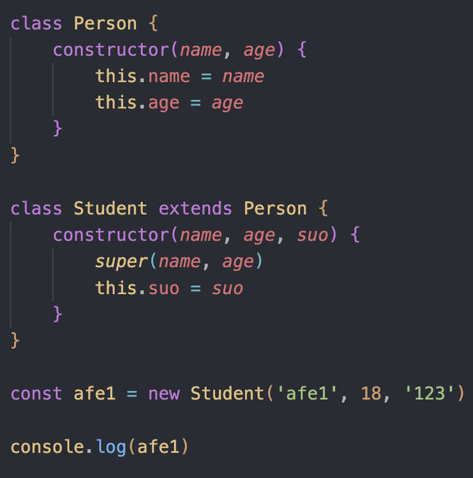
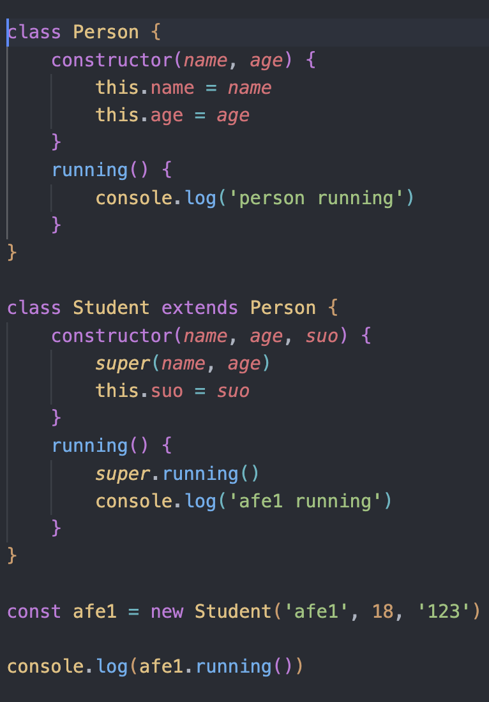

- class类
  - new关键字调用
  - class的构造方法constructor,new调用的时候自动执行
    - 1.创建一个对象 moni = {}
    - 2.讲类的prototype赋值给对象的__proto__ Preson.prototype = moni.__proto__
    - 3.将this指向为创建的对象
    - 4.执行函数中的代码
    - 5.返回对象
  - 继承extends，super
    - 
    - 
- 模块化
  - 为什么要模块化
    - 代码之间相互影响
  - commonjs
    - 导出 module.exports/exports
    - 导入 require
    - 导入区别
      - module.exports = {}
      - exports = module.exports = {}
      - exports不是直接操作导出对象
