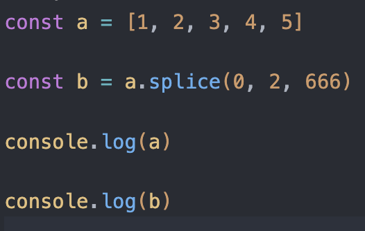
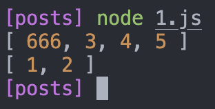
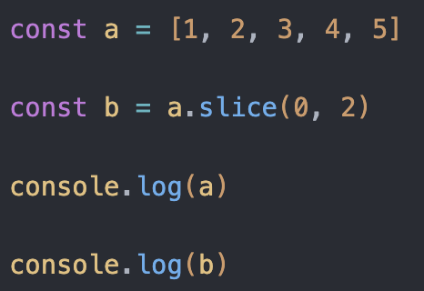
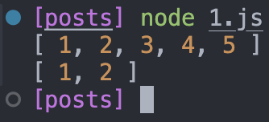
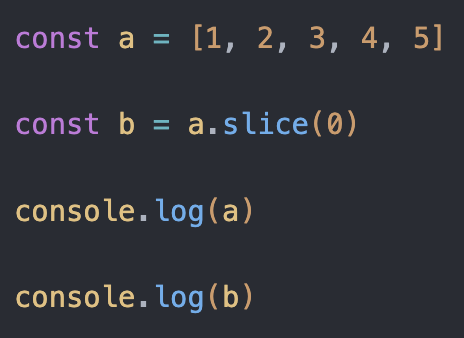
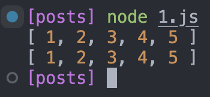

- 自我介绍

- 如何实现按钮权限

- 如何配置动态路由
  - route

- 数组的方法
  - splice(start,deleteCount,item1,item2...)开始删除的位置，删除的个数，要添加的数据,会改变原数组，返回删除的数据
    - 
    - 

- slice(start,end)开始位置到结束位置，不包括结束位置，不会改变原来数组,不传end直接截取到最后
  - 
  - 
  - 
  - 

  - unshift,push返回数组长度

  - shift,pop返回删除元素

  - concat连接两个数组

  - join不回改变原数组，join数组转成字符串，入参为字符串连接方式

  - sort要return出去，改变原数组

- 页面上通过勾选实现页面路由权限，按钮路由权限是如何实现的
